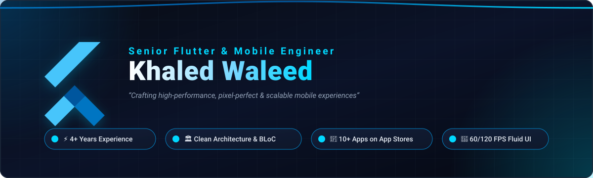

<!-- ══════════════════════════════════════ HEADER ══════════════════════════════════════ -->

<div align="center">



<br/><br/>

<a href="https://github.com/khaledarman22">
  
</a>

<p align="center">
  <a href="https://linkedin.com/in/khaled-waleed-a95b70208"></a>
  &nbsp;
  <a href="mailto:Khaled.waleed.dev@gmail.com"></a>
  &nbsp;
  <a href="https://raw.githubusercontent.com/khaledarman22/khaledarman22/main/assets/Khaled_Waleed_Resume.pdf"></a>
  &nbsp;
  <a href="https://twitter.com/khaled_waleed_x"></a>
  &nbsp;
  
</p>

</div>

---

<!-- ══════════════════════════════════════ ABOUT ══════════════════════════════════════ -->

## 👨‍💻 About Me

```dart
class FlutterLeadEngineer {
  final String name = 'Khaled Waleed';
  final String currentRole = 'Flutter Team Lead & Senior Mobile Engineer';
  final int experienceYears = 5;
  final int publishedAppsCount = 15;
  final double crashFreeRate = 99.4; // %

  final List<String> coreCompetencies = [
    'Clean Architecture, MVVM & SOLID Principles',
    'Enterprise State Management (BLoC / Cubit / Provider)',
    'Full RTL / Localization (Arabic, English, Italian)',
    'CI/CD Pipelines (Fastlane, GitHub Actions) & Release Automation',
    'AI-Assisted High-Velocity Engineering',
    'Team Mentorship & Architecture Governance'
  ];

  void deliverExcellence() {
    buildHighPerformanceApps();
    maintainRockSolidStability();
    mentorAndElevateTeam();
  }
}
```

- 🏛️ **Flutter Team Lead & Senior Engineer** with **5+ years** of hands-on experience architecting, scaling, and shipping enterprise-grade cross-platform apps for **iOS and Android**.
- 🚀 Shipped **15+ commercial applications** across Google Play and Apple App Store spanning E-Commerce, Sports, Fitness, Loyalty & On-Demand services.
- ⚡ Deep expertise in **Clean Architecture**, **BLoC / Cubit**, **Freezed / Code Generation**, **Dio Caching**, **Offline-First Synchronization (Hive / SQLite)**, and **Multi-Flavor CI/CD**.
- 🛡️ Maintained a **>99% crash-free session rate** across production deployments through rigorous profiling, Sentry, and Firebase Crashlytics monitoring.

---

<!-- ═══════════════════════════════════ TECH STACK ════════════════════════════════════ -->

## 🛠️ Technical Arsenal

<div align="center">

### 📱 Core & Frameworks


### 🧠 Architecture & State Management


### 🌐 Networking, Backend & Data Persistence


### ⚙️ CI/CD, Quality & Native Integrations


-FFA000?style=for-the-badge&logo=firebase&logoColor=black)


### 🚀 App Publishing


</div>

---

<!-- ══════════════════════════════════ PUBLISHED PRODUCTION APPS ═════════════════════════ -->

## 📱 Published Production Apps (Selection)

| App | Category | Key Highlights & Architecture | Store Links |
| :--- | :--- | :--- | :---: |
| 🍕 **La Carapellese** | E-Commerce / Food | Live delivery tracking, digital wallet & loyalty, full multi-language RTL (AR / EN / IT) | **App Store · Google Play** |
| ⚽ **Hatrick** | Sports & Scouting | Football talent-scouting platform connecting players, scouts & clubs with video challenges | **App Store · Google Play** |
| 🏋️ **FTTech Pro** | Fitness & Nutrition | Workout & custom nutrition tracker for professional trainers and clients | **App Store · Google Play** |
| 🎁 **Mazaya** | Loyalty & Deals | QR-code redemption, geolocation-based merchant offers & coupons | **App Store** |
| 👥 **Grand Community** | Social & Influencers | Dual-application modular architecture serving users and creator network | **App Store · Google Play** |

---

<!-- ══════════════════════════════════ FEATURED OPEN-SOURCE PROJECTS ══════════════════════ -->

## 🌟 Featured Open-Source Projects

| Project | Description | Tech Stack | Repository |
| :--- | :--- | :--- | :---: |
| 🎬 **Movies App** | Feature-rich movie browsing app showcasing Clean Architecture, BLoC, Dio caching, and responsive UI | `Flutter` `Clean Architecture` `BLoC` `Dio` | [View Repo ↗](https://github.com/khaledarman22/movies-clean-architecture-) |
| 📚 **Bookly App** | Modern eBook discovery and reader application following MVVM architecture and REST integration | `Flutter` `Dart` `MVVM` `REST API` | [View Repo ↗](https://github.com/khaledarman22/bookly-app-mvvm) |
| 🏷️ **Mazady Auction** | Real-time bidding and auction marketplace application with state management | `Flutter` `BLoC` `Firebase` `Dio` | [View Repo ↗](https://github.com/khaledarman22/mazady) |
| 🎧 **Podcast & Music** | Streaming audio and podcast player with custom audio playback controls and adaptive layout | `Flutter` `Audio Player` `REST API` | [View Repo ↗](https://github.com/khaledarman22/podcast-music) |
| 🛒 **MiniMart Store** | Complete e-commerce store with product catalog, cart, and checkout flow | `Flutter` `BLoC` `Dio` `Hive` | [View Repo ↗](https://github.com/khaledarman22/serv5-minimart-assignment) |

---

<!-- ═════════════════════════════════════ STATS ═══════════════════════════════════════ -->

## 📊 GitHub Analytics

<div align="center">


<br/><br/>


<br/><br/>


&nbsp;


</div>

---

<!-- ════════════════════════════════════ CONNECT ══════════════════════════════════════ -->

## 🤝 Let's Connect & Collaborate

<div align="center">

Open to **Senior / Lead Flutter Roles**, **Remote Opportunities**, and **Mobile App Consulting**.

<br/>

<a href="https://linkedin.com/in/khaled-waleed-a95b70208"></a>
&nbsp;
<a href="mailto:Khaled.waleed.dev@gmail.com"></a>
&nbsp;
<a href="https://raw.githubusercontent.com/khaledarman22/khaledarman22/main/assets/Khaled_Waleed_Resume.pdf"></a>
&nbsp;
<a href="https://twitter.com/khaled_waleed_x"></a>
&nbsp;
<a href="https://instagram.com/khaled.waleed.social"></a>
&nbsp;
<a href="https://www.facebook.com/share/15eqea4tvf/"></a>

<br/><br/>

> *“Quality in a mobile application is not an accident; it is always the result of intelligent effort and clean code.”*

<br/>

💙 **Crafted with passion by Khaled Waleed — Senior Flutter Engineer & Team Lead**

</div>
